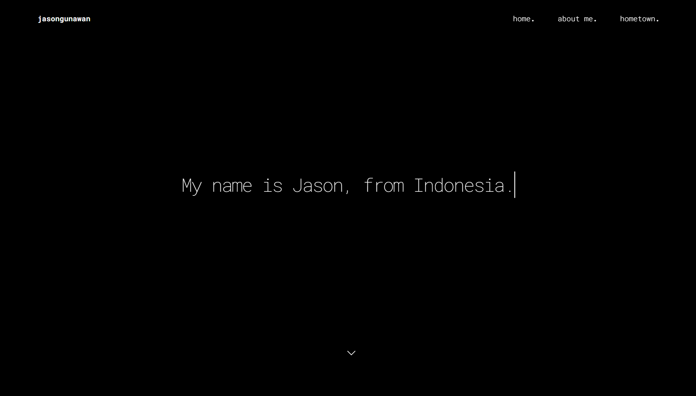
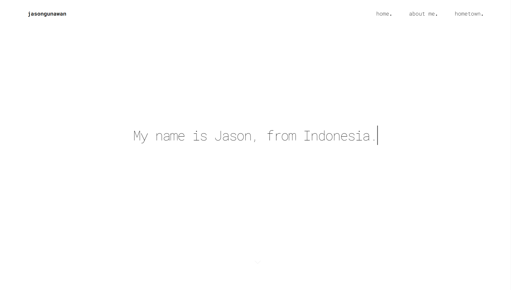
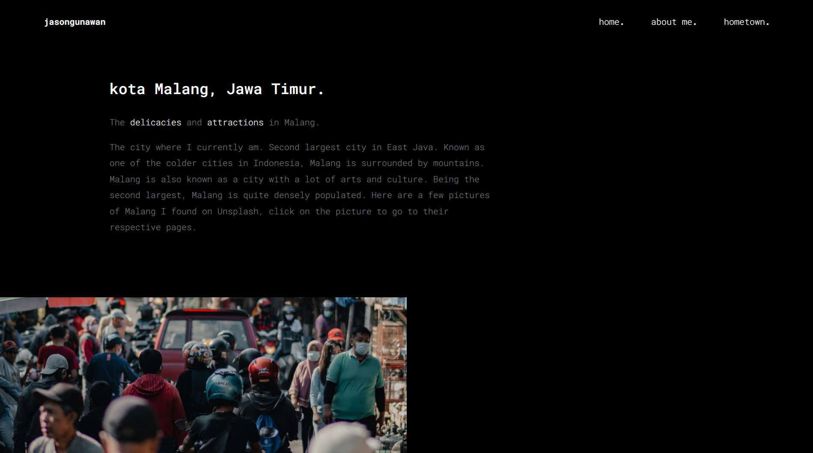
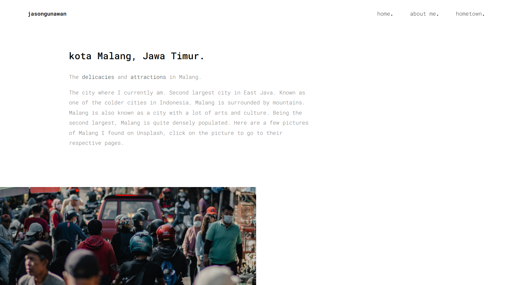

# Web Programming (C) - Quiz 1

[the website.](https://jasandgun.github.io/quiz1/)

## first look
switch between modes by clicking on `jasandgun`
> intro page, dark and light

> hometown page, dark and light

### issues
> typing animation is still not responsive to smaller screens

## website design inspired by this tutorial:

## dark mode (no-flicker) made possible by this tutorial:
https://derekkedziora.com/blog/dark-mode-revisited
